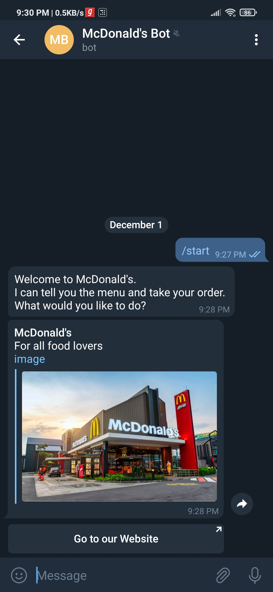

# Telegram ChatBot

This repository contains a .Zip file that is the exported file of my chatbot, which was made using DialogFlow.

## Steps to Import the zip file again are:
   * Go to BotFather Channel in telegram, and create a new bot using (/newbot) command.
   * Enter the name of your bot and give a suitable username to it.
   * A token for your ChatBot will be generated. Copy the toke code to your clipboard.
   * The link of your code will pop up in the same previous message. 
   * Open DialogFlow website in any browser and click on Create Agent.
       * Go to the Export and Import tab.
       * Click on Import from ZIP and upload the ZIP file from this repository.
   * Go to Integrations tab and select the telegram option there. Paste the token and click on Start.
   * Your Bot will get started. You will get its link in the Telegram BotFather Channel.

## Some screenshots of the bot are attached here : 

